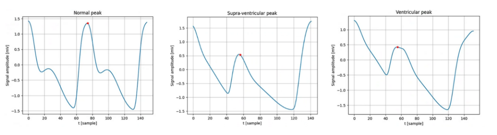

# PAC-PVC CLASSIFIER for PPG
#### APPLIED AI PROJECT @ POLIMI
- Andrea Naclerio  ([@AndreaNaclerio](https://github.com/AndreaNaclerio)) andrea.naclerio@mail.polimi.it
- Federico Pivetta (TODO,inserire github fede) federico1.pivetta@mail.polimi.it

The goal of this project is to build two models that classify **photoplethysmogram**, PPG, and peaks. The models are aimed to solve binary and multi-class classification problems and they should provide an estimation of the confidence of the prediction. The multi-class model classifies into 3 classes:
- Normal (N)
- Premature Supraventricular Contraction (S)
- Premature Ventricular Contraction (V)

while the binary classifier classifies an input sample into pathological (S and V) and non-pathological (N). Moreover, one metric should be defined to monitor and evaluate the performance of the models.

  

## PREPROCESSING
In the preprocessing phase, the raw data underwent several steps:

1. **Resampling**: Signals were standardized to a 128 Hz sampling frequency to ensure uniformity, and peak positions were updated accordingly.

2. **Signal Windowing**: Signals were split into windows containing individual peaks, with window length determined by extracting each peak individually based on the previous and next peaks.

3. **Filtering**: Single peaks underwent filtering to remove outliers and denoise signals.

   - **Length Filtering**: Physiological window lengths were defined based on heartbeat range (40-180 bpm) to filter data, preserving information during premature beats.
   
   - **Amplitude Filtering**: Signals were filtered based on amplitude range (-4mV to +4mV) to retain characteristic morphology. High-amplitude signals underwent additional filtering to remove high-frequency noise.

4. **Length Standardization**: Due to varied window lengths, additional padding was added at both ends to standardize window lengths, maintaining information about the current peak.

5. **Data Splitting**: Data splitting was performed to prevent bias by consistently dividing patients between training and validation
 

## MODELS
In addressing both binary and multi-class classification challenges, diverse methodologies were employed. 
- For binary classification, an ensemble approach was used to handle unbalanced data, training the identified optimal model five times with different sets. The focus was on reducing false negatives, and a weighted loss function and threshold tuning were applied.
- In multi-class classification, two consecutive binary models were implemented, followed by additional machine learning models (Random Forest, SVM, KNN) for further refinement.

Deep learning models, including 1D-convolutional networks and recurrent layers (LSTM, BLSTM), were explored with different architectures. Confidence computation involved mapping predictions to confidence values, with specific considerations for binary and multi-class scenarios. 
